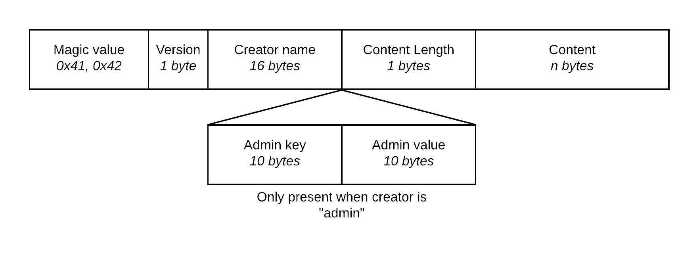

# SXT File Reader

This is a simple program that reads a self-created file format called SXT. It accepts one argument; the filename of the SXT file it needs to print. It will print the following details:

* Version
* Creator name
* Is the creator an admin? If so, print the key, value pair of the adminTag (this is to introduce more code paths in the file).
* The ASCII body length, and content in HEX.

There are various spatial memory safety bugs present:

* Creator name might cause a buffer overflow as the NULL-terminator can be outside the bounds of the struct.
* The buffer overflow of the creator name can cause privilege escalation when it overrides the “isAdmin” boolean to 0x01. This triggers an additional code path.
* The AdminTag key,value pair can cause a buffer overflow if the NULL-terminator is outside the bounds of the struct.
* The contentLength byte might exceed the length of the file, causing a buffer overread as the program allocates a buffer according to “contentLength”, but fills it according to the file size.
